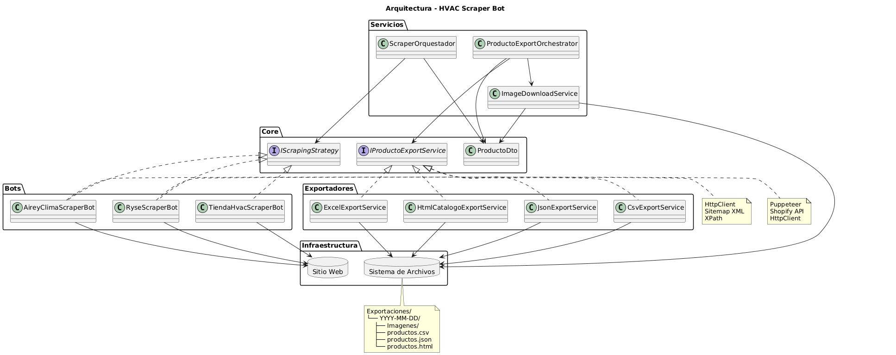
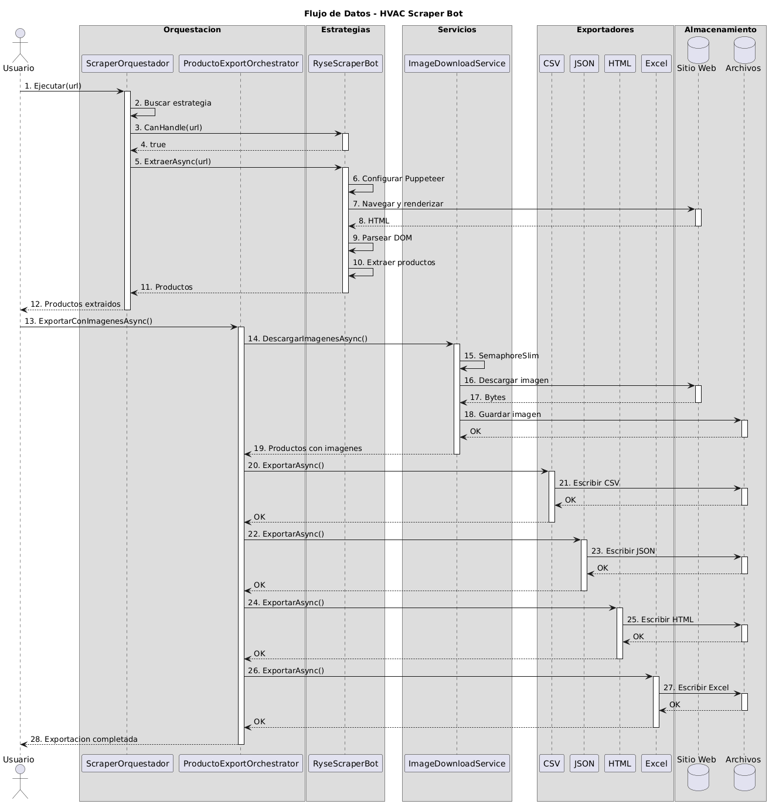
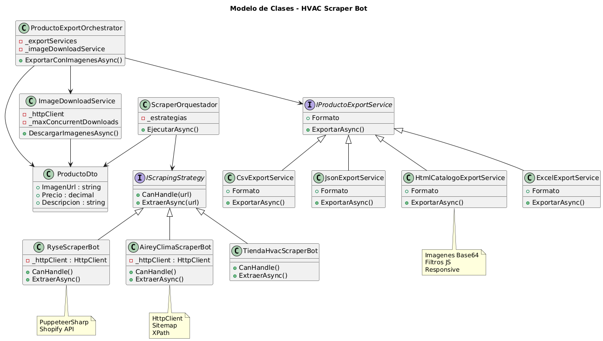

# 🕷️ HVAC Scraper Bot

> **Sistema inteligente de scraping automatizado para catálogos de equipos HVAC con exportación multi-formato**

[](https://dotnet.microsoft.com/)
[](https://docs.microsoft.com/en-us/dotnet/csharp/)
[](https://pptr.dev/)
[](LICENSE)

---

## 📋 Table of Contents

- [Overview](#-overview)
- [Features](#-features)
- [Architecture](#-architecture)
- [Installation](#-installation)
- [Usage](#-usage)
- [Example Output](#-example-output)
- [Technologies](#-technologies)
- [Project Structure](#-project-structure)
- [License](#-license)
- [Author](#-author)

---

## 🎯 Overview

**HVAC Scraper Bot** es un sistema inteligente de scraping diseñado específicamente para extraer productos de sitios web de equipos de aire acondicionado y climatización.

### Problema que Resuelve

| Problema | Solución |
|----------|----------|
| **Sitios con JavaScript** | Puppeteer renderiza contenido dinámico |
| **Múltiples fuentes** | Patrón Strategy para diferentes sitios |
| **Descarga de imágenes** | Descarga concurrente con SemaphoreSlim |
| **Diferentes formatos** | Exportación a CSV, JSON, Excel y HTML |

### Características Principales

- ✅ **Scraping multi-estrategia** con patrón Strategy
- ✅ **Soporte para sitios dinámicos** (Puppeteer headless)
- ✅ **Descarga concurrente de imágenes** con control de concurrencia
- ✅ **Exportación a 4 formatos**: CSV, JSON, Excel y HTML
- ✅ **Catálogo visual interactivo** con imágenes incrustadas
- ✅ **Arquitectura extensible** para agregar nuevos bots fácilmente
- ✅ **Manejo de errores y fallbacks** para sitios no accesibles

---

## ✨ Features

### 📊 Scraping Inteligente

| Bot | Sitio | Tecnología |
|-----|-------|------------|
| **RyseScraperBot** | ryse.com.mx | Puppeteer + Shopify API |
| **AireyClimaScraperBot** | aireyclimaespecializado.com.mx | HttpClient + Sitemap |
| **TiendaHvacScraperBot** | Simulación | HtmlAgilityPack |

### 💾 Exportación Multi-Formato

| Formato | Descripción |
|---------|-------------|
| **CSV** | Para análisis en Excel |
| **JSON** | Para integración con APIs |
| **HTML** | Catálogo visual interactivo |
| **Excel** | Con formato profesional (EPPlus) |

### 🖼️ Procesamiento de Imágenes

- ✅ Descarga concurrente con límite de conexiones
- ✅ Conversión a Base64 para HTML
- ✅ Almacenamiento local organizado
- ✅ Nombres de archivo seguros

---

## 🏗️ Architecture

### Diagrama de Componentes


### Diagrama de Flujo


### Modelo de Clases


### Patrón Strategy

El sistema utiliza el **patrón Strategy** para manejar diferentes sitios web:

```csharp
public interface IScrapingStrategy
{
    bool CanHandle(string url);
    Task<List<ProductoDto>> ExtraerAsync(string url);
}
Cada bot implementa su propia lógica de extracción:

csharp
public class RyseScraperBot : IScrapingStrategy
{
    public bool CanHandle(string url)
        => url.Contains("rysemexico", StringComparison.OrdinalIgnoreCase);

    public async Task<List<ProductoDto>> ExtraerAsync(string url)
    {
        // Puppeteer + Shopify API
    }
}
Flujo de Datos
text
URL → ScraperOrquestador → Bot Seleccionado → Productos → Exportador
🚀 Installation
Prerrequisitos
✅ .NET 8 SDK

✅ Visual Studio 2022 o superior

✅ Git

Setup
bash
# 1. Clonar repositorio
git clone https://github.com/tu-usuario/HvacScraperBot.git

# 2. Navegar al proyecto
cd HvacScraperBot

# 3. Restaurar paquetes
dotnet restore

# 4. Ejecutar
dotnet run --project HvacScraper.Console
📖 Usage
Ejecutar el Bot
bash
dotnet run --project HvacScraper.Console
Personalizar URL
csharp
// En Program.cs
string urlObjetivo = "https://www.rysemexico.com/";
Estructura de Exportación
text
Exportaciones/
└── YYYY-MM-DD_HH-mm-ss/
    ├── Imagenes/
    │   ├── producto_1.jpg
    │   ├── producto_2.jpg
    │   └── ...
    ├── productos_ryse_YYYYMMDD_HHmmss.csv
    ├── productos_ryse_YYYYMMDD_HHmmss.json
    ├── productos_ryse_YYYYMMDD_HHmmss.html
    └── productos_ryse_YYYYMMDD_HHmmss.xlsx
📊 Example Output
text
🚀 ========================================
   SISTEMA HVAC SCRAPER BOT v2.0
   Extracción y Exportación Automatizada
========================================

📡 [FASE 1/3] Extrayendo productos de Ryse México...
   URL: https://www.rysemexico.com/

✅ Extracción exitosa: 45 productos encontrados

📊 [FASE 2/3] Mostrando resumen de productos:
══════════════════════════════════════════════════════════════════

📦 Producto #1
   🏷️  Equipo: Minisplit Inverter 1.5T
   💰 Precio: $12,499.00 MXN
   🖼️  Imagen URL: https://.../imagen1.jpg

📦 Producto #2
   🏷️  Equipo: Minisplit Inverter 2T
   💰 Precio: $18,950.00 MXN
   🖼️  Imagen URL: https://.../imagen2.jpg

   ... y 43 productos más.

══════════════════════════════════════════════════════════════════
💾 [FASE 3/3] Descargando imágenes y exportando datos...

📸 Descarga de imágenes completada:
   ✅ Exitosas: 42
   ❌ Fallidas: 3
   📁 Ubicación: Exportaciones/2025-01-01_12-34-56/Imagenes

✅ Exportado en CSV: productos_ryse_20250101_123456.csv
✅ Exportado en JSON: productos_ryse_20250101_123456.json
✅ Exportado en HTML: productos_ryse_20250101_123456.html
✅ Exportado en Excel: productos_ryse_20250101_123456.xlsx

══════════════════════════════════════════════════════════════════
✨ ¡PROCESO COMPLETADO EXITOSAMENTE!

📁 Carpeta de exportación:
   Exportaciones/2025-01-01_12-34-56/

📋 Estructura generada:
   📂 2025-01-01_12-34-56/
   ├── 📂 Imagenes/
   │   └── 42 imágenes descargadas
   ├── 📄 productos_ryse_20250101_123456.csv (15.2 KB)
   ├── 📄 productos_ryse_20250101_123456.json (22.8 KB)
   ├── 📄 productos_ryse_20250101_123456.html (245.1 KB)
   └── 📄 productos_ryse_20250101_123456.xlsx (18.5 KB)

💡 Tips:
   • Abre el archivo .html en tu navegador para ver el catálogo visual
   • Importa el .csv en Excel para análisis de datos
   • Las imágenes se guardaron en la subcarpeta 'Imagenes/'
   • El archivo .json contiene todos los datos estructurados
🛠️ Technologies
Tecnología	Versión	Propósito
.NET	8.0	Framework principal
PuppeteerSharp	Latest	Headless browser
HtmlAgilityPack	Latest	Parseo de HTML
EPPlus	Latest	Exportación a Excel
System.Text.Json	-	Exportación a JSON
📂 Project Structure
text
HvacScraperBot/
├── CodigoLimpio.Core/
│   ├── DTOs/
│   │   └── ProductoDto.cs
│   ├── Interfaces/
│   │   ├── IScrapingStrategy.cs
│   │   └── IProductoExportService.cs
│   └── Servicios/
│       ├── Exportadores/
│       │   ├── CsvExportService.cs
│       │   ├── JsonExportService.cs
│       │   ├── HtmlCatalogoExportService.cs
│       │   └── ExcelExportService.cs
│       ├── ImageDownloadService.cs
│       ├── ProductoExportOrchestrator.cs
│       └── ScraperOrquestador.cs
├── HvacScraper.Console/
│   └── Infrastructure/
│       └── Bots/
│           ├── RyseScraperBot.cs
│           ├── AireyClimaScraperBot.cs
│           └── TiendaHvacScraperBot.cs
├── Images/
│   ├── arquitectura.png
│   ├── flujo.png
│   └── modelo-clases.png
├── README.md
├── LICENSE
└── .gitignore
🔧 Cómo Agregar un Nuevo Bot
Crear una nueva clase que implemente IScrapingStrategy

csharp
public class NuevoScraperBot : IScrapingStrategy
{
    public bool CanHandle(string url)
        => url.Contains("nuevositio", StringComparison.OrdinalIgnoreCase);

    public async Task<List<ProductoDto>> ExtraerAsync(string url)
    {
        // Tu lógica de scraping aquí
        return new List<ProductoDto>();
    }
}
Registrar el bot en el orquestador

csharp
var listaBots = new List<IScrapingStrategy>
{
    new RyseScraperBot(httpClient),
    new NuevoScraperBot(httpClient),
};
🤝 Contributing
🍴 Fork el repositorio

🌿 Crea una rama (git checkout -b feature/AmazingFeature)

💾 Commit tus cambios (git commit -m 'Add some AmazingFeature')

📤 Push a la rama (git push origin feature/AmazingFeature)

📝 Abre un Pull Request

📄 License
Este proyecto está bajo la Licencia MIT - ver el archivo LICENSE para más detalles.

👤 Author
Tu Nombre

💼 LinkedIn

🐙 GitHub

📧 Email

🙏 Acknowledgments
PuppeteerSharp por el headless browser

HtmlAgilityPack por el parseo de HTML

EPPlus por la exportación a Excel

🕷️ Made with ❤️ for HVAC Industry

text

---

## 📝 INSTRUCCIONES PARA GUARDAR

1. **Copia TODO el texto de arriba** (desde `# 🕷️ HVAC Scraper Bot` hasta el final)

2. **Abre tu `README.md`** en VS Code

3. **Reemplaza TODO el contenido** (Ctrl+A, Ctrl+V)

4. **Guarda** (Ctrl+S)

5. **Sube a GitHub:**

```bash
git add README.md
git commit -m "docs: agregar README profesional para HVAC Scraper Bot"
git push origin main
